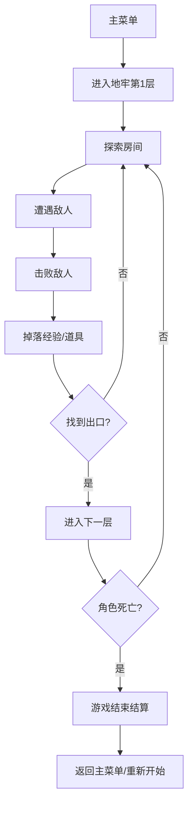

# 像素地牢探险 — 产品需求文档

## 1. 产品概述

一款像素风俯视角地牢探险 Roguelike 小游戏。玩家扮演一名像素冒险者，深入随机生成的地牢，击败怪物、收集宝物、寻找通往下一层的阶梯，在层层递进的难度中尽可能深入地底。

- **核心体验**：探索未知的紧张感 + 收集成长的满足感 + 战斗操作的爽快感
- **目标用户**：喜爱复古 RPG、地牢探险类游戏的玩家

## 2. 核心功能

### 2.1 用户角色
| 角色 | 说明 |
|------|------|
| 冒险者 | 玩家操控的主角，拥有血量、攻击力、移速属性 |

### 2.2 功能模块

1. **主菜单**：游戏标题、开始游戏、操作说明
2. **地牢探险**：随机生成的地图、房间探索、怪物战斗、道具收集
3. **战斗系统**：近战攻击、受击反馈、死亡与重新开始
4. **升级系统**：击败怪物获得经验，升级提升属性
5. **游戏结束**：死亡界面显示到达层数、击杀数、分数

### 2.3 页面详情

| 页面 | 模块 | 功能描述 |
|------|------|----------|
| 主菜单 | 标题区 | 像素风动态标题 |
| 主菜单 | 开始按钮 | 点击进入地牢第1层 |
| 主菜单 | 操作说明 | WASD移动、空格攻击、拾取道具 |
| 游戏主画面 | 地图渲染 | 俯视角地牢，墙壁/地板/门/迷雾 |
| 游戏主画面 | 角色控制 | 流畅的八方向移动与攻击 |
| 游戏主画面 | HUD | 血条、经验条、当前层数、击杀数 |
| 游戏主画面 | 道具拾取 | 走近自动拾取血瓶/宝石/武器 |
| 结束界面 | 结算面板 | 到达层数、击杀数、总得分 |

## 3. 核心流程

## 4. 游戏玩法设计

### 4.1 角色属性

| 属性 | 初始值 | 成长方式 |
|------|--------|----------|
| 生命值 | 100 | 升级+20，血瓶+30 |
| 攻击力 | 15 | 升级+3，武器+10 |
| 移动速度 | 160px/s | 升级+10 |
| 攻击范围 | 40px | 升级+5 |
| 攻击冷却 | 0.4秒 | 升级-0.02（最低0.2） |

### 4.2 操作指令

| 操作 | 按键 |
|------|------|
| 移动 | WASD / 方向键 |
| 攻击 | 空格 / 鼠标左键 |
| 拾取道具 | 自动（走近即可） |

### 4.3 地牢生成规则

- 每层生成 5-8 个房间，通过走廊连接
- 房间类型：普通房间（刷怪）、宝箱房（无怪有宝）、BOSS房（每层最后）
- 其中一个普通房间包含通往下一层的阶梯
- 墙壁不可穿越，门需要清完房间内所有怪物后自动开启

### 4.4 敌人类型

| 敌人 | 血量 | 攻击 | 速度 | 特点 |
|------|------|------|------|------|
| 史莱姆 | 30 | 8 | 慢 | 绿色，会弹跳靠近玩家 |
| 骷髅兵 | 50 | 12 | 中等 | 白色骨架，直线追击 |
| 蝙蝠 | 20 | 6 | 快 | 棕色，不规则飞行轨迹 |
| 地牢守卫(BOSS) | 200 | 20 | 慢 | 每层BOSS，攻击带击退 |

### 4.5 道具系统

| 道具 | 效果 | 外观 |
|------|------|------|
| 红色药水 | 恢复30点生命 | 红色瓶子 |
| 蓝色宝石 | +50经验值 | 蓝色菱形 |
| 金色宝箱 | 随机提升一项属性 | 金色箱子 |
| 武器升级 | 攻击力+10 | 剑图标 |

### 4.6 胜负机制

- **死亡**：血量归零，游戏结束，显示本局统计
- **深入**：每通过一层获得层数加分
- **分数计算**：层数×100 + 击杀数×10 + 收集宝石×5

## 5. 用户界面设计

### 5.1 设计风格

- **主题**：复古地牢探险 RPG 风格
- **主色调**：深褐石墙(#3d2b1f) + 暗绿地板(#1a2e1a) + 金色高光(#ffd700)
- **像素感**：16x16 图块单位，所有元素对齐像素网格
- **字体**：像素风等宽字体（Press Start 2P）
- **光影**：角色周围有圆形光照范围，未探索区域有战争迷雾

### 5.2 页面设计概览

| 页面 | 模块 | 设计要点 |
|------|------|----------|
| 主菜单 | 背景 | 深色石砖纹理，火把微光闪烁 |
| 主菜单 | 标题 | "DUNGEON PIXEL" 金色像素大字 |
| 主菜单 | 角色展示 | 中央玩家角色待机动画 |
| 游戏画面 | 地牢地图 | 石墙、地板、门用16x16图块拼贴 |
| 游戏画面 | 光照效果 | 玩家周围圆形光照，边缘渐暗 |
| 游戏画面 | HUD | 左上角血条(红)、经验条(蓝)、层数 |
| 结束界面 | 统计面板 | 居中显示：到达层数、击杀数、总分 |

### 5.3 响应式适配

- **画布尺寸**：固定 800x600（4:3 复古比例）
- **摄像机跟随**：玩家始终位于画面中央，地图随玩家滚动
- **缩放适配**：根据窗口大小等比缩放

## 6. 素材方案

### 6.1 程序生成像素素材

所有素材通过 Canvas 代码绘制，不依赖外部图片。

| 素材 | 尺寸 | 绘制方式 |
|------|------|----------|
| 玩家角色 | 24x24 | 蓝色斗篷+棕色头发+持剑姿势 |
| 史莱姆 | 20x20 | 绿色凝胶状，会上下弹跳 |
| 骷髅兵 | 24x24 | 白色骨架+红色眼睛 |
| 蝙蝠 | 16x16 | 棕色翅膀扇动动画 |
| BOSS | 40x40 | 紫色铠甲巨怪 |
| 墙壁 | 32x32 | 深褐色石砖纹理 |
| 地板 | 32x32 | 暗绿色石板，带细微纹理变化 |
| 门 | 32x32 | 木门/铁栅栏，开启时消失 |
| 阶梯 | 32x32 | 向下石阶 |
| 道具 | 16x16 | 药水/宝石/宝箱像素画 |
| 攻击特效 | 动态 | 白色像素剑弧 |

### 6.2 动画设计

| 动画 | 描述 |
|------|------|
| 玩家待机 | 轻微上下呼吸浮动 |
| 玩家移动 | 腿部交替迈步（4帧循环） |
| 玩家攻击 | 挥剑动作，前方出现白色剑弧 |
| 史莱姆 | 弹跳移动，身体压缩拉伸 |
| 骷髅 | 行走时骨骼微微晃动 |
| 蝙蝠 | 翅膀快速扇动（2帧循环） |
| 受击 | 白色闪烁一帧，向后小幅度击退 |
| 死亡 | 倒地，逐渐变透明消失 |
