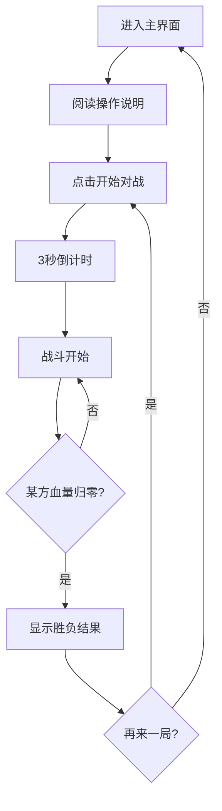
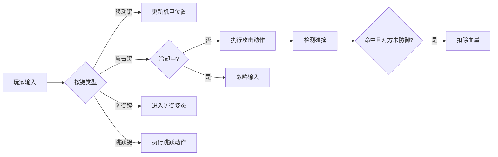

# 像素风机甲对战游戏 - 产品需求文档

## 1. 产品概述

一款基于浏览器的双人对战像素风机甲格斗小游戏。两名玩家分别操控各自的机甲，在复古风格的战斗场景中进行实时对战，通过移动、攻击、防御等操作削减对方血量，直至一方战败。

- **核心体验**：即时格斗的紧张感 + 像素复古美学
- **目标用户**：喜爱像素游戏、怀旧街机风格的休闲玩家

## 2. 核心功能

### 2.1 用户角色
| 角色 | 说明 | 操作方式 |
|------|------|----------|
| 玩家1（蓝方机甲） | 左侧出生 | WASD移动，F攻击，G防御，H跳跃 |
| 玩家2（红方机甲） | 右侧出生 | 方向键移动，小键盘1攻击，2防御，3跳跃 |

### 2.2 功能模块

1. **游戏主界面**：像素风格标题、开始按钮、操作说明
2. **战斗场景**：像素机甲、战斗场地、血条UI、计时器
3. **对战结束界面**：胜负结果、再来一局按钮

### 2.3 页面详情

| 页面名称 | 模块名称 | 功能描述 |
|----------|----------|----------|
| 主界面 | 标题区 | 像素风游戏标题动画 |
| 主界面 | 操作说明 | 双方机甲的操作按键指引 |
| 主界面 | 开始按钮 | 点击进入战斗场景 |
| 战斗场景 | 游戏画布 | 像素机甲对战主画面，支持移动/攻击/防御/跳跃 |
| 战斗场景 | HUD状态栏 | 双方血条、机甲名称、倒计时 |
| 结束界面 | 结果展示 | 显示获胜方、对战数据统计 |
| 结束界面 | 重开按钮 | 重新开始对战 |

## 3. 核心流程

### 3.1 对战流程

### 3.2 操作逻辑

## 4. 游戏玩法设计

### 4.1 机甲属性

| 属性 | 数值 | 说明 |
|------|------|------|
| 初始血量 | 100点 | 血条归零则战败 |
| 普通攻击伤害 | 12点 | 命中且对方未防御时扣除 |
| 防御减伤 | 70% | 防御姿态下受到伤害减少70% |
| 移动速度 | 120px/s | 水平移动速度 |
| 跳跃高度 | 80px | 垂直跳跃高度 |
| 攻击冷却 | 0.5秒 | 两次攻击之间的间隔 |
| 防御耐力 | 持续防御3秒后破防 | 破防后有1秒硬直 |

### 4.2 操作指令

| 玩家 | 左移 | 右移 | 跳跃 | 攻击 | 防御 |
|------|------|------|------|------|------|
| 玩家1（蓝方） | A | D | W | F | G |
| 玩家2（红方） | ← | → | ↑ | 小键盘1 | 小键盘2 |

### 4.3 胜负机制

- **KO胜利**：一方血量率先归零，另一方获胜
- **时间到**：若倒计时结束双方均存活，血量高者获胜；血量相同则为平局
- **单场时长**：每局限时99秒

### 4.4 像素动画设计

| 动画状态 | 描述 |
|----------|------|
| 待机 | 机甲上下微浮动，呼吸感 |
| 移动 | 机甲水平位移，腿部交替摆动（2帧） |
| 跳跃 | 向上跃起，滞空，下落 |
| 攻击 | 机甲手臂前伸，出现像素剑光/拳影（3帧） |
| 防御 | 机甲前方出现像素能量盾，身体微蹲 |
| 受击 | 机甲向后仰，闪烁红色（3帧） |
| 战败 | 机甲倒地，零件散落（5帧） |

## 5. 用户界面设计

### 5.1 设计风格

- **主题**：复古街机格斗游戏风格
- **主色调**：深蓝背景(#1a1c2c) + 霓虹蓝(#00d4ff) + 霓虹红(#ff3864)
- **像素感**：所有素材使用8x8或16x16像素块构建
- **字体**：像素风等宽字体（Press Start 2P）
- **UI元素**：直角边框，无圆角，像素级描边

### 5.2 页面设计概览

| 页面 | 模块 | 设计要点 |
|------|------|----------|
| 主界面 | 背景 | 深色星空/网格底纹，缓慢滚动 |
| 主界面 | 标题 | "MECHA BATTLE" 像素大字，带闪烁霓虹效果 |
| 主界面 | 机甲展示 | 左右两侧展示待机动画的机甲 |
| 主界面 | 操作面板 | 像素边框面板，列出双方按键 |
| 战斗场景 | 背景 | 像素工厂/竞技场场景，多层视差 |
| 战斗场景 | 地面 | 金属平台，带像素纹理 |
| 战斗场景 | 血条 | 顶部左右对称，蓝/红渐变色，带像素边框 |
| 结束界面 | 结果 | 中央大字"P1 WIN"或"P2 WIN"，带缩放动画 |

### 5.3 响应式适配

- **桌面端优先**：固定画布尺寸 960x540（16:9）
- **缩放适配**：根据窗口大小等比缩放画布，保持像素清晰
- **全屏支持**：提供全屏按钮，战斗时推荐全屏体验

## 6. 素材方案

### 6.1 素材类型

所有素材均采用**程序生成像素画**，不依赖外部图片资源，确保游戏可独立运行。

| 素材 | 尺寸 | 生成方式 |
|------|------|----------|
| 蓝方机甲 | 48x64 | Canvas绘制：蓝色装甲+天线+机械臂 |
| 红方机甲 | 48x64 | Canvas绘制：红色装甲+角+机械臂 |
| 攻击特效 | 32x32 | Canvas绘制：白色像素剑光/冲击波 |
| 防御护盾 | 48x48 | Canvas绘制：半透明六边形能量盾 |
| 受击特效 | 24x24 | Canvas绘制：红色像素火花 |
| 地面平台 | 960x80 | Canvas绘制：金属灰像素纹理 |
| 背景建筑 | 960x540 | Canvas绘制：深色工厂轮廓 |
| 血条UI | 动态 | Canvas绘制：带像素边框的渐变矩形 |

### 6.2 音效设计（可选增强）

| 音效 | 描述 |
|------|------|
| 攻击命中 | 8-bit打击音 |
| 防御格挡 | 金属碰撞音 |
| 跳跃 | 短促电子音 |
| 战败 | 下降8-bit音效 |

*注：基础Demo可先以视觉反馈为主，音效作为可选增强。*
