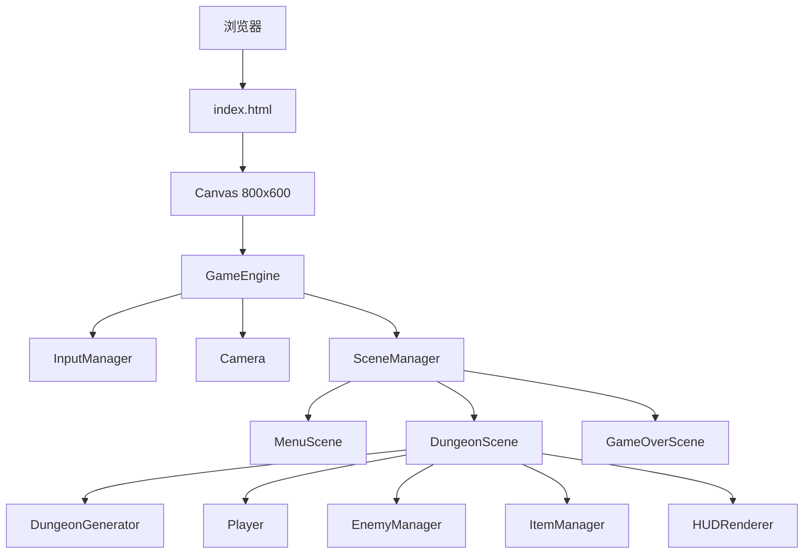

# 像素地牢探险 — 技术架构文档

## 1. 架构设计



## 2. 技术选型

| 层级 | 技术 | 说明 |
|------|------|------|
| 前端 | 原生 HTML5 + Canvas 2D + JS | 无框架依赖 |
| 构建 | 无 | 纯静态文件 |
| 素材 | Canvas 程序绘制 | 全部像素素材代码生成 |

## 3. 文件结构

```
/workspace/
├── dungeon/
├── index.html
├── style.css
└── js/
    ├── constants.js
    ├── utils.js
    ├── dungeonGenerator.js
    ├── camera.js
    ├── player.js
    ├── enemy.js
    ├── items.js
    ├── scenes.js
    └── main.js
```

## 4. 核心模块

### 4.1 DungeonGenerator
- 房间+走廊的BSP式生成
- 每个房间记录：x, y, w, h, type, enemies[], items[]
- 走廊用直线连接相邻房间中心
- 返回二维瓦片数组（0地板, 1墙壁, 2门, 3阶梯）

### 4.2 Player
- 位置、速度、属性（hp, atk, speed, range）
- 经验值与升级逻辑
- 攻击检测：扇形/圆形范围内的敌人
- 碰撞检测：与墙壁、敌人

### 4.3 Enemy
- 基类 + 子类（Slime, Skeleton, Bat, Boss）
- AI：向玩家移动，进入攻击范围则攻击
- 状态：idle, chase, attack, hit, dead

### 4.4 Camera
- 跟随玩家，平滑插值
- 视口裁剪：只渲染屏幕内瓦片和实体

### 4.5 渲染策略
- 瓦片大小：32x32
- 先渲染地板，再渲染墙壁，再渲染实体
- 光照：使用 radial gradient 遮罩实现圆形视野
- 迷雾：记录已探索区域，未探索区域用黑色覆盖

## 5. 碰撞检测
- 玩家/敌人 vs 墙壁：AABB 检测
- 攻击 vs 敌人：距离检测 + 攻击冷却
- 拾取道具：距离 < 20px 自动拾取

## 6. 游戏循环
```
loop:
  1. 计算 dt
  2. 处理输入
  3. 更新玩家（移动、攻击、升级）
  4. 更新所有敌人（AI、碰撞）
  5. 更新道具（拾取检测）
  6. 更新摄像机
  7. 渲染地图（地板→墙壁→门）
  8. 渲染实体（道具→敌人→玩家→特效）
  9. 渲染光照遮罩 + 迷雾
  10. 渲染 HUD
```
