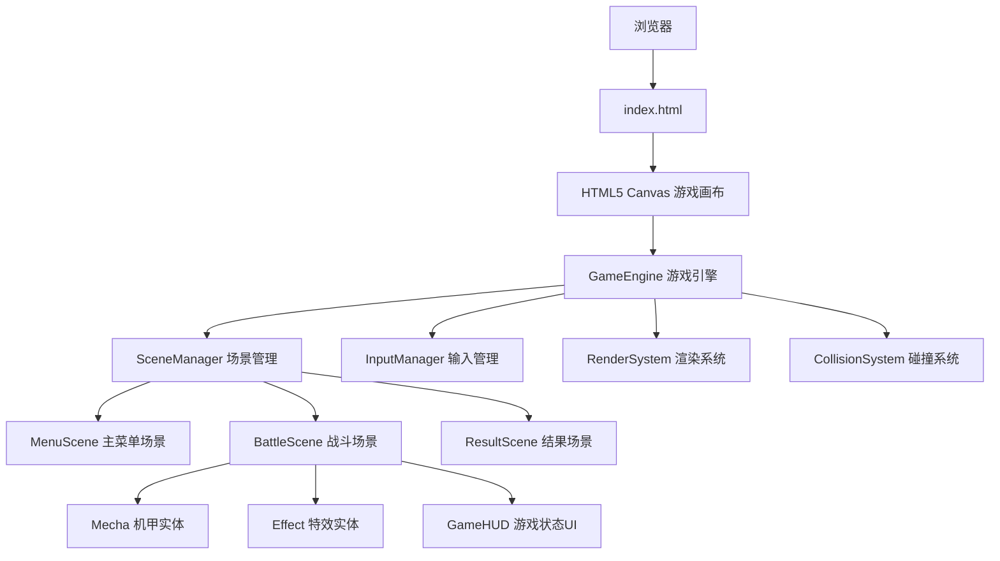

# 像素风机甲对战游戏 - 技术架构文档

## 1. 架构设计



## 2. 技术选型

| 层级 | 技术 | 说明 |
|------|------|------|
| 前端 | 原生 HTML5 + CSS3 + JavaScript | 无需框架，Canvas 2D 直接渲染 |
| 构建工具 | 无 / 可选 Vite | 纯静态文件，可直接在浏览器运行 |
| 素材 | Canvas 程序绘制 | 所有像素素材通过代码动态生成 |
| 数据存储 | 无 | 无需持久化存储 |
| 网络 | 无 | 本地双人同屏对战 |

## 3. 文件结构

```
/workspace/
├── index.html              # 主入口，包含画布和基础样式
├── style.css               # 像素风样式、字体加载、画布居中
├── js/
│   ├── main.js             # 入口：初始化画布、启动游戏循环
│   ├── engine/
│   │   ├── GameEngine.js   # 核心引擎：游戏循环(60fps)、时间管理
│   │   ├── InputManager.js # 键盘输入监听、按键状态映射
│   │   ├── SceneManager.js # 场景切换、状态管理
│   │   └── Renderer.js     # 画布上下文管理、像素渲染辅助
│   ├── scenes/
│   │   ├── BaseScene.js    # 场景基类：update/render接口
│   │   ├── MenuScene.js    # 主菜单：标题动画、按钮、操作说明
│   │   ├── BattleScene.js  # 战斗场景：实体管理、碰撞检测、胜负判定
│   │   └── ResultScene.js  # 结果界面：胜负展示、数据统计
│   ├── entities/
│   │   ├── Mecha.js        # 机甲类：属性、状态机、动画、攻击/防御/受击逻辑
│   │   └── Effect.js       # 特效类：攻击特效、受击特效、粒子效果
│   └── utils/
│       ├── PixelDrawer.js  # 像素绘制工具：矩形/线条/圆的点阵化渲染
│       ├── Constants.js    # 游戏常量：画布尺寸、按键映射、属性数值
│       └── Animator.js     # 动画工具：帧动画管理、插值函数
```

## 4. 核心类设计

### 4.1 GameEngine

```javascript
class GameEngine {
  constructor(canvas)
  start()          // 启动 requestAnimationFrame 循环
  update(dt)       // 每帧更新逻辑
  render()         // 每帧渲染
  setScene(scene)  // 切换场景
}
```

### 4.2 Mecha（机甲实体）

```javascript
class Mecha {
  constructor(x, y, color, controls)
  update(dt)       // 更新位置、状态、动画
  render(ctx)      // 绘制机甲像素画
  attack()         // 发起攻击
  defend(active)   // 进入/退出防御
  jump()           // 跳跃
  takeDamage(dmg)  // 受击扣血
  // 状态: idle | move | jump | attack | defend | hit | dead
}
```

### 4.3 InputManager

```javascript
class InputManager {
  constructor()
  keydown(e)       // 记录按键按下
  keyup(e)         // 记录按键释放
  isPressed(key)   // 查询按键状态
}
```

## 5. 渲染策略

### 5.1 像素画渲染方式

- 关闭 Canvas 抗锯齿：`ctx.imageSmoothingEnabled = false`
- 所有图形使用整数坐标绘制
- 机甲/特效通过 `fillRect` 逐像素块构建
- 使用离屏 Canvas 预渲染静态素材（地面、背景）

### 5.2 动画帧率

- 游戏逻辑更新：60fps（requestAnimationFrame）
- 机甲动画：8帧/秒（每8帧切换一次动画帧）
- 特效动画：12帧/秒

## 6. 碰撞检测

### 6.1 攻击判定

- 机甲攻击时生成攻击判定框（AABB）
- 每帧检测攻击框与对方机甲受击框是否重叠
- 防御状态下：伤害减免70%，播放格挡特效
- 非防御状态：全额伤害，播放受击特效

### 6.2 边界判定

- 机甲不能移出画布左右边界
- 机甲受重力影响，落地后停止下落
- 地面高度固定为画布底部80px区域

## 7. 游戏循环时序

```
requestAnimationFrame loop:
  1. 计算 deltaTime (dt)
  2. InputManager 更新按键状态
  3. 当前 Scene.update(dt) — 更新所有实体逻辑
  4. 碰撞检测与处理
  5. 当前 Scene.render(ctx) — 绘制所有元素
  6. 请求下一帧
```

## 8. 性能考量

- 使用单一 Canvas，避免多图层开销
- 背景和地面使用离屏 Canvas 预渲染
- 特效使用对象池复用，避免频繁创建销毁
- 粒子数量限制在50个以内

## 9. 浏览器兼容性

- 支持所有现代浏览器（Chrome、Firefox、Safari、Edge）
- 使用标准 ES6+ 语法，无需转译
- 不依赖任何第三方库
